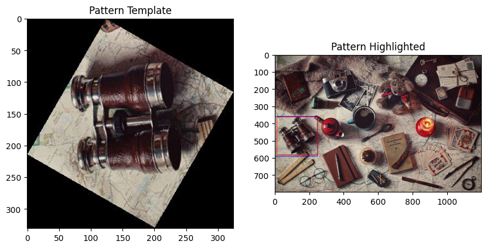
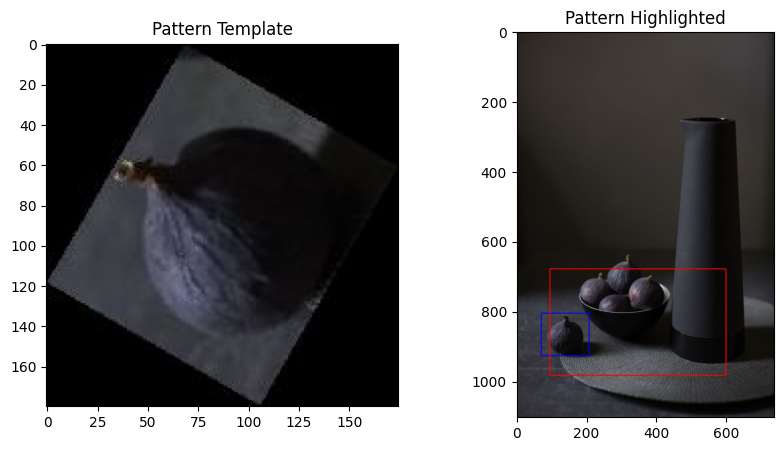

#  Задача поиска объекта на изображении по шаблону

## Решение
* Создание SIFT-дескриптора (Scale Invariant Feature Transform)
* Нахождение ключевых точек на исходном изображении и паттерне
* Нахождение совпадений с помощью BF-matcher'а (Brute-Force Matching)
* Выделение 15 совпадений с наименьшим расстоянием
* Создание массива координат ключевых точек исходного изображения
* Удаление точек, у которых Z-score больше 2.5
* Построение рамки по наименьшим координатам x,y из массива с увеличением прямоугольника на 30 пикселей по периметру

## Пример выделения ключевых точек

## Сравнение решений и эталонных значений

## Метрикa
Среднее значение метрики - `62.39`

